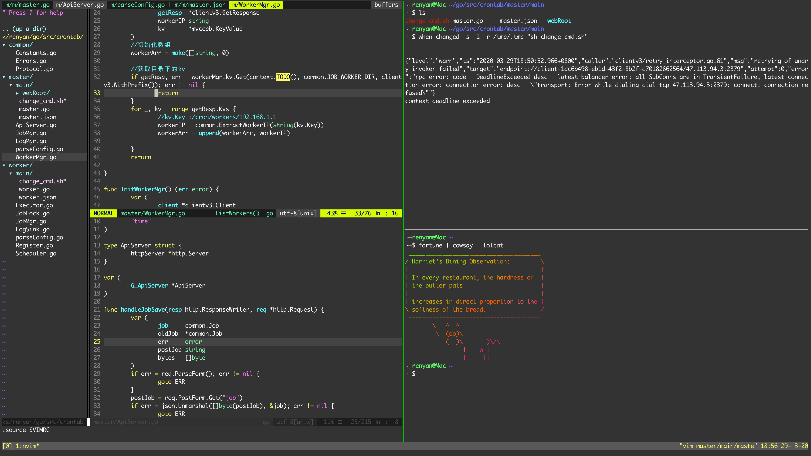

<p align="center"></p>
<p align="center">效果图</p>

### todo
- [ ] 相关快捷键介绍
- [ ] 编写自动安装脚本

注：以CentOS7为例，其他类似
### 依赖安装
1、系统安装包升级
```shell
yum update
yum install -y https://dl.fedoraproject.org/pub/epel/epel-release-latest-7.noarch.rpm
```
2、yum包
```shell
yum install -y \
golang \
python36 \
nodejs \
npm \
git \
vim \
htop \
nload \
the_silver_searcher \
tldr \
wget \
net-tools \
telnet \
lsof \
unzip \
xclip \
ctags \
aria2 \
zsh \
ncurses-devel \
libevent-devel \
tig \
jq \
ShellCheck
```
3、pip包
```shell
pip3 install supervisor pynvim jedi rope
```
4、神器安装
* [oh-my-zsh](https://github.com/ohmyzsh/ohmyzsh)
```shell
sh -c "$(curl -fsSL https://raw.githubusercontent.com/ohmyzsh/ohmyzsh/master/tools/install.sh)""
```
* [tmux](https://github.com/tmux/tmux)
```shell
cd /usr/local/apps
wget https://github.com/tmux/tmux/releases/download/3.3/tmux-3.3.tar.gz
tar -xvzf tmux-3.0a.tar.gz
cd tmux-3.0a/
./configure && make
sudo make install
```
* [neovim](https://github.com/neovim/neovim/releases/tag/v0.4.3)
```shell
cd /usr/local/apps
wget https://github.com/neovim/neovim/releases/download/v0.4.3/nvim-linux64.tar.gz
tar -xvzf nvim-linux64.tar.gz
ln -s /usr/local/apps/nvim-linux64/bin/nvim /usr/local/bin/vim
```
* [zsh-autosuggestions](https://github.com/zsh-users/zsh-autosuggestions/blob/master/INSTALL.md#oh-my-zsh)
```shell
git clone https://github.com/zsh-users/zsh-autosuggestions ${ZSH_CUSTOM:-~/.oh-my-zsh/custom}/plugins/zsh-autosuggestions
```
* [yarn](https://classic.yarnpkg.com/en/docs/install#mac-stable)
```shell
curl -o- -L https://yarnpkg.com/install.sh | bash
```

* [bash language server](https://github.com/bash-lsp/bash-language-server)
```
npm i -g bash-language-server
```

### 配置
当前项目下执行
```shell
source init.sh
source ~/.zshrc
```

### Vim插件安装
1、国内访问git速度极慢，需要配置http代理
```shell
setproxy  # 需提前配置代理服务器
```
2、安装插件管理器vim-plug
```shell
curl -fLo ~/.local/share/nvim/site/autoload/plug.vim --create-dirs \
    https://raw.githubusercontent.com/junegunn/vim-plug/master/plug.vim
```
3、coc.nvim依赖安装
```
curl -sL install-node.now.sh/lts | bash
```
4、nvim命令打开后执行`:PlugInstall`

### Coc.nvim
* 增加拓展插件(nvim打开后执行)
```vim
:CocInstall coc-python coc-json coc-html coc-list coc-tsserver
```
